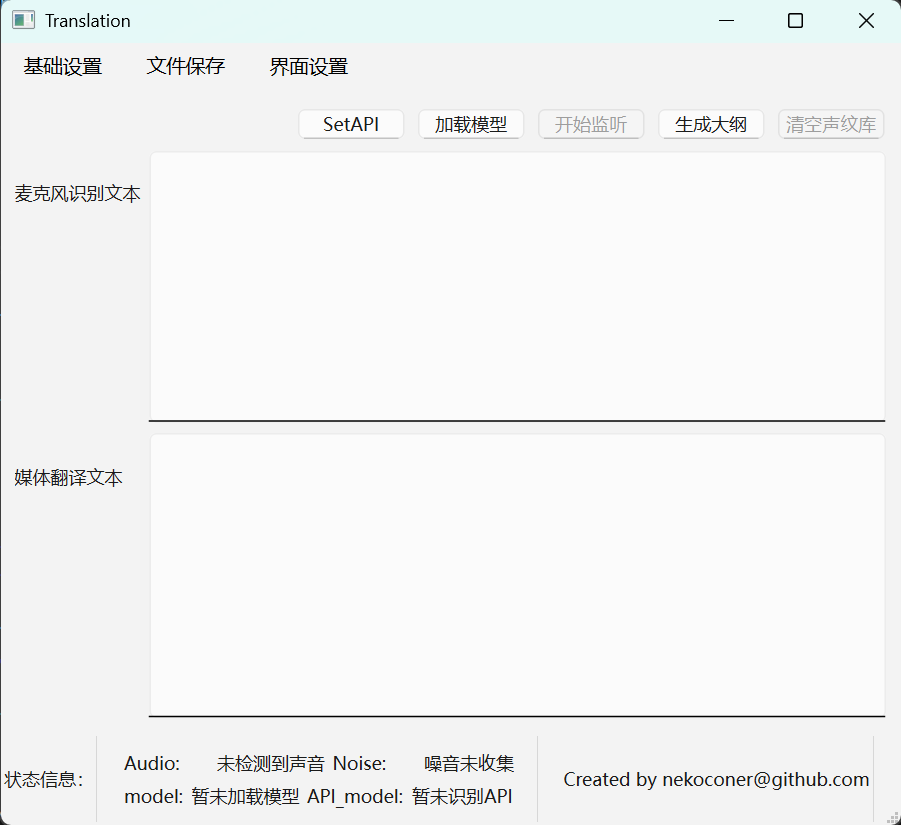

# Realtime_STT_System

## 中文 (Chinese)

### 项目介绍
Realtime_STT_System 是一个先进的语音转文本（Speech-to-Text）系统，支持实时语音识别、翻译和说话人识别。该项目基于 V6 版本，集成了最新的 AI 技术和音频处理算法。

### 功能特性
- **实时语音识别 (ASR)**: 使用 Whisper 模型进行高精度语音转文本，支持日文识别。
- **智能翻译**: 集成 DeepSeek 或 Grok API，将日文文本翻译成中文。
- **说话人识别 (CAM)**: 使用声纹识别技术，区分不同说话人并标记输出。
- **噪音过滤**: 自动收集和过滤环境噪音，提高识别准确性。
- **多音频来源**: 支持麦克风、扬声器音频和硬盘音频文件。
- **图形用户界面 (GUI)**: 基于 PyQt6 的直观界面，易于操作。
- **文件保存**: 可保存音频文件、识别文本和翻译文本。
- **大纲生成**: 使用 AI 总结对话内容，生成中文大纲。
- **GPU 支持**: 可选择 CPU 或 GPU 运行，提升性能。

### QT 界面展示


### 技术栈
- **编程语言**: Python
- **GUI 框架**: PyQt6
- **音频处理**: PyAudio, webrtcvad, noisereduce
- **AI 模型**: Whisper (transformers), funasr (声纹识别)
- **API 集成**: OpenAI API (DeepSeek, Grok)
- **深度学习**: PyTorch
- **其他**: NumPy, threading

### 安装说明
1. 克隆项目仓库：
   ```
   git clone https://github.com/nekoconer/Realtime-STT-System.git
   cd Realtime-STT-System
   ```
2. 使用 Conda 创建并安装环境：
   ```
   conda env create -f environment.yml
   conda activate LLM
   ```
3. 下载模型文件到 `./model/` 目录。
4. 配置 `config_zh.json` 文件，设置 API 密钥等参数。

### 使用方法
1. 运行主程序：
   ```
   python main_windows_v6.py
   ```
2. 在 GUI 中设置 API 密钥。
3. 选择音频来源并加载模型。
4. 开始监听并进行语音识别和翻译。

### 贡献
欢迎提交 Issue 和 Pull Request。请遵循项目的编码规范。

### 许可证
本项目采用 MIT 许可证。

---

## 日本語 (Japanese)

### プロジェクト紹介
Realtime_STT_System は、リアルタイム音声認識、翻訳、話者識別をサポートする高度な音声テキスト変換（Speech-to-Text）システムです。このプロジェクトは V6 バージョンに基づき、最新の AI 技術と音声処理アルゴリズムを統合しています。

### 機能特性
- **リアルタイム音声認識 (ASR)**: Whisper モデルを使用して高精度な音声テキスト変換を行い、日本語認識をサポート。
- **インテリジェント翻訳**: DeepSeek または Grok API を統合し、日本語テキストを中国語に翻訳。
- **話者識別 (CAM)**: 声紋識別技術を使用して、異なる話者を区別し、出力をマーク。
- **ノイズフィルタリング**: 環境ノイズを自動収集・フィルタリングし、認識精度を向上。
- **マルチオーディオソース**: マイク、スピーカーオーディオ、ハードディスクオーディオファイルをサポート。
- **グラフィカルユーザーインターフェース (GUI)**: PyQt6 ベースの直感的なインターフェースで操作が簡単。
- **ファイル保存**: オーディオファイル、認識テキスト、翻訳テキストを保存可能。
- **アウトライン生成**: AI を使用して会話内容を要約し、中国語アウトラインを生成。
- **GPU サポート**: CPU または GPU を選択して実行し、パフォーマンスを向上。

### 技術スタック
- **プログラミング言語**: Python
- **GUI フレームワーク**: PyQt6
- **オーディオ処理**: PyAudio, webrtcvad, noisereduce
- **AI モデル**: Whisper (transformers), funasr (声紋識別)
- **API 統合**: OpenAI API (DeepSeek, Grok)
- **ディープラーニング**: PyTorch
- **その他**: NumPy, threading

### インストール説明
1. リポジトリをクローン：
   ```
   git clone https://github.com/nekoconer/Realtime-STT-System.git
   cd Realtime-STT-System
   ```
2. Conda を使用して環境を作成しインストール：
   ```
   conda env create -f environment.yml
   conda activate LLM
   ```
3. モデルファイルを `./model/` ディレクトリにダウンロード。
4. `config_zh.json` ファイルを設定し、API キーなどのパラメータを設定。

### 使用方法
1. メインプログラムを実行：
   ```
   python main_windows_v6.py
   ```
2. GUI で API キーを設定。
3. オーディオソースを選択し、モデルをロード。
4. リスニングを開始し、音声認識と翻訳を実行。

### 貢献
Issue と Pull Request の提出を歓迎します。プロジェクトのコーディング規約に従ってください。

### ライセンス
このプロジェクトは MIT ライセンスを採用しています。

---

## English

### Project Introduction
Realtime_STT_System is an advanced Speech-to-Text system that supports real-time speech recognition, translation, and speaker identification. This project is based on version V6, integrating the latest AI technologies and audio processing algorithms.

### Features
- **Real-time Speech Recognition (ASR)**: Uses Whisper model for high-accuracy speech-to-text, supporting Japanese recognition.
- **Intelligent Translation**: Integrates DeepSeek or Grok API to translate Japanese text to Chinese.
- **Speaker Identification (CAM)**: Uses voiceprint recognition technology to distinguish different speakers and mark outputs.
- **Noise Filtering**: Automatically collects and filters environmental noise to improve recognition accuracy.
- **Multiple Audio Sources**: Supports microphone, speaker audio, and hard disk audio files.
- **Graphical User Interface (GUI)**: Intuitive interface based on PyQt6 for easy operation.
- **File Saving**: Can save audio files, recognized text, and translated text.
- **Outline Generation**: Uses AI to summarize conversation content and generate Chinese outlines.
- **GPU Support**: Choose CPU or GPU for execution to enhance performance.

### Technology Stack
- **Programming Language**: Python
- **GUI Framework**: PyQt6
- **Audio Processing**: PyAudio, webrtcvad, noisereduce
- **AI Models**: Whisper (transformers), funasr (voiceprint recognition)
- **API Integration**: OpenAI API (DeepSeek, Grok)
- **Deep Learning**: PyTorch
- **Others**: NumPy, threading

### Installation Instructions
1. Clone the repository:
   ```
   git clone https://github.com/nekoconer/Realtime-STT-System.git
   cd Realtime-STT-System
   ```
2. Create and install the environment using Conda:
   ```
   conda env create -f environment.yml
   conda activate LLM
   ```
3. Download model files to the `./model/` directory.
4. Configure the `config_zh.json` file, setting API keys and other parameters.

### Usage
1. Run the main program:
   ```
   python main_windows_v6.py
   ```
2. Set the API key in the GUI.
3. Select audio source and load the model.
4. Start listening and perform speech recognition and translation.

### Contributing
Issues and Pull Requests are welcome. Please follow the project's coding standards.

### License
This project is licensed under the MIT License.
